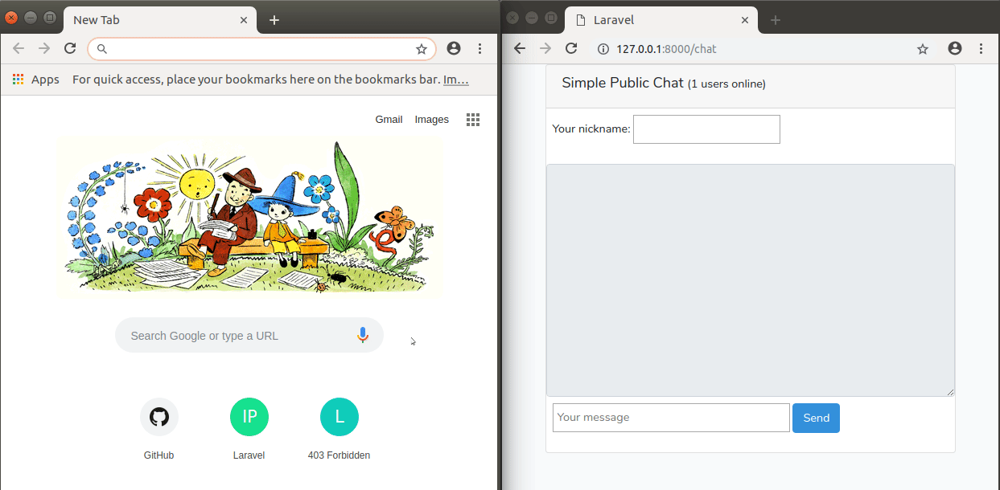

# Laravel Vue.js Socket.io Chat (+ Redis)
Simple Laravel Vue.js Socket.io Chat (+ Redis)

### Server requirements:
- Linux + Apache/Nginx + Php
- Node.js
- Redis
- Composer

### How to use:
1. Clone this repository
2. Change dir `cd laravel-vuejs-socketio-chat`
3. Run `composer install`
4. Run `npm install` (Node.js should be installed)
5. Make sure you use `BROADCAST_DRIVER=redis` in .env file
6. `node server.js`
7. `php artisan serve`

